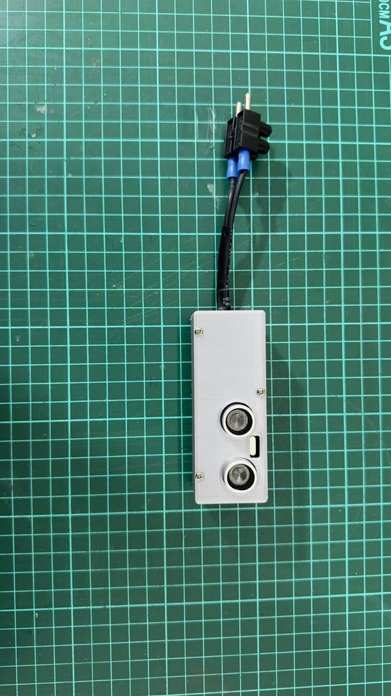

# Contador:
Contador de personas y objetos usando ultrasonido

# Chasis:
Object counter using ultrasonic HC-SR04 and Arduino Nano with apple type +5v supply
https://www.thingiverse.com/thing:7058359

Object counter using ultrasonic HC-SR04 and ESP8266 wemos d1 mini with apple type +5v supply
https://www.thingiverse.com/thing:7055390

# Fuente:
Se puede usar una fuente simil Apple o una fuente Hi-Link 5V (https://tcsindustrial.com/shop/es/electronics/233-fuente-de-alimentacion-arduino-5v-3w-switching-chip.html)

# Conexion:
Seguir las instrucciones en el archivo .ino
